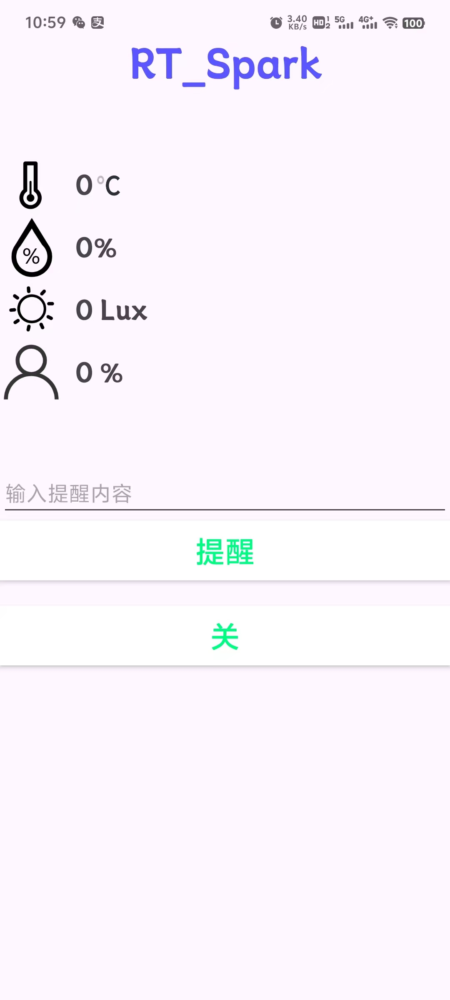

# 基于RT—Thread的单词阅读器

开发板：星火一号

开发环境：env+vscode

## 0.环境搭建

参考：http://t.csdnimg.cn/xLCPD

## 1.需要准备

* sd卡：并将 [0.sdcard](https://github.com/CYFS3/rt-thread_demo/tree/main/project/0.sdcard)复制到根目录下
* 纽扣电池：用于RTC时钟，非必须，因为项目会自动NTP（网络授时）

##  2.传感器读取

使能板载的**AHT21**和**AP3216C**

* AHT21：可以读取环境的温湿度
* AP3216C：可以读取环境的光强以及检查人体

## 3.MQTT上传云端

将传感器数据上传云端，并消息转发给app端

参考：http://t.csdnimg.cn/Y6T2z

效果：

## 4.lvgl

lvgl界面由gui-guider生成

sconscript参考

~~~python
import rtconfig

from building import *

cwd = GetCurrentDir()
CPPPATH = [cwd, str(Dir('#'))]
CPPDEFINES = ['']

include_path = [ cwd,
    os.path.join(cwd,"custom"),
    os.path.join(cwd,"generated"),
    os.path.join(cwd,"generated/guider_customer_fonts"),
    os.path.join(cwd,"generated/guider_fonts"),
    os.path.join(cwd,"generated/images")
]

src = Glob('*.c')

src += Glob('custom/*.c')
src += Glob('generated/*.c')
src += Glob('generated/guider_customer_fonts/*.c')
src += Glob('generated/guider_fonts/*.c')
src += Glob('generated/images/*.c')
src += Glob('./*.c')

group = DefineGroup('GUI-Guider-demo', src, depend = [''], CPPPATH = include_path, CPPDEFINES=CPPDEFINES)

Return('group')
~~~

## 5.FAL

用于存储字库

## 6.elm-fatfs

用于读取sd卡中的单词

## 7.单词

可通过按钮切换单词

效果：

## 8.app

可以获取传感器数据、控制led_matrix 和发送提醒

